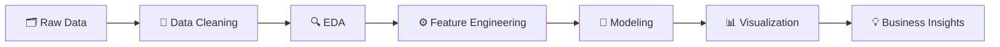

# 👋 Hi, I'm Mohan Kumar

### Data Analyst · SQL · Python · Power BI · Machine Learning

 

---

## 🧑‍💻 About Me

I'm a **Junior Data Analyst** passionate about transforming raw datasets into meaningful insights that drive data-driven decisions.

- 🔍 Experienced in **SQL**, **Python**, **Power BI**, and **Machine Learning**
- 📈 Specialized in **Time Series Forecasting** and **Exploratory Data Analysis (EDA)**
- 📊 Skilled at building interactive dashboards that communicate business value
- 🌱 Currently deepening expertise in **Data Warehousing**, **DAX**, and **Advanced SQL Optimization**

---
 
## 💼 Work Experience
 
### 🟢 Junior QA Analyst — Firebee Techno Services
📍 Madurai, India &nbsp;|&nbsp; 🗓️ Mar 2025 – Present
 
- Performed functional, regression, integration, and UAT testing in **Agile environments**, contributing to test design and improved coverage
- Identified and documented bugs, working closely with developers to ensure timely resolution
- Experienced with **Postman** and **Excel** for manual testing, and **Playwright with Python** for automation; familiar with SDLC and STLC
---
 
### 🔵 QA Trainee — Predart Technologies
📍 Theni, India &nbsp;|&nbsp; 🗓️ Jun 2024 – Mar 2025
 
- Developed and executed manual test cases to ensure software quality
- Gained proficiency in **test planning**, **bug tracking**, and **defect reporting**
- Collaborated cross-functionally to understand requirements and deliver high-quality releases
---
 
### 🟣 Data Science Intern — Shiash Info Solutions
📍 Chennai, India &nbsp;|&nbsp; 🗓️ Dec 2023 – Apr 2024
 
- Performed **machine learning modeling**, data visualization, and time series analysis
- Developed **Django-based** data science web applications
- Built predictive models and dashboards that improved insight delivery speed by **20%**

---

## 📊 Portfolio at a Glance

| 📁 Analytics Projects | 🤖 ML Projects | 📊 Power BI Dashboards | 📈 Forecasting Models | 🏅 Certifications |
|:---:|:---:|:---:|:---:|:---:|
| 10+ | 5+ | 5+ | 10+ | 10+ |

---

## ⚡ Skills & Tech Stack
 
### 🐍 Programming Languages

  
  
  

### 🗄️ Database & Spreadsheet

  
  
  
  

### 🔬 Data Analytics

  
  
  
  
  
  
  
  

### 📊 Data Visualization

  
  
  
  
  

### 🤖 Machine Learning & Deep Learning

  
  
  
  
  
  

### 🛠️ Tools & Frameworks

  
  
  
  

### 🧠 Soft Skills

| 💡 Analytical Thinking | 🔍 Attention to Detail | 🗣️ Communication | 🧩 Problem-Solving | ⏰ Time Management |
|:---:|:---:|:---:|:---:|:---:|
| ✅ | ✅ | ✅ | ✅ | ✅ |

---

## 🚀 Featured Projects
 
### 💱 [Currency Exchange Rate Forecasting](https://github.com/mohankumar-dxplr/Currency-Exchange-Rate-Forecasting)
> **Python · LSTM · ARIMA · SVR · Random Forest · TensorFlow · Statsmodels**
 
Built hybrid time series forecasting models to predict **EUR/INR**, **USD/INR**, and **NZD/USD** exchange rates. Benchmarked LSTM-ARIMA, LSTM-SVR, and SVR-RF pipelines with full data preprocessing and feature engineering — **LSTM-SVR** delivered the best forecasting performance.
 
---
 
### 🏨 [Revenue Insights — Hospitality Domain](https://github.com/mohankumar-dxplr/Data_Analytics/tree/main/Revenue%20Insights%20in%20Hospitality%20Domain%20Report)
> **Power BI · Python · Excel · SQL**
 
Designed an interactive executive-level dashboard covering hotel **revenue trends, occupancy rates, customer ratings, and booking channel performance** using dimensional data models (date, room, booking dimensions). Delivered insight-ready PDF exports alongside the `.pbip` Power BI report for business stakeholders.
 
---
 
### 🍬 [Candy Distributor Analysis](https://github.com/mohankumar-dxplr/Data_Analytics/tree/main/Candy_Distributor_Analysis)
> **Python · Power BI · Pandas**
 
End-to-end distribution analytics project including **data preprocessing, quality checks, feature engineering, and EDA** on candy sales data. Delivered a Power BI dashboard (`candy_distribution.pbix`) and a detailed markdown report highlighting distributor performance and division-level mismatches.
 
---
 
### 🚗 [Car Data Analysis](https://github.com/mohankumar-dxplr/Data_Analytics/tree/main/Car%20Data%20Analysis)
> **Python · Power BI · Pandas**
 
Explored pricing, fuel efficiency, brand comparisons, and market trends across a comprehensive vehicle dataset. Produced visual dashboard outputs and a structured summary report for market insight.
 
---
 
### 🏏 [T20 Cricket Analytics](https://github.com/mohankumar-dxplr/Data_Analytics/tree/main/T20%20CRICKET%20ANALYTICS%20REPORT)
> **Power BI · Python · Pandas**
 
Sports analytics dashboard built on **dimensional star-schema datasets** (dim/fact CSVs) covering batting, bowling, team, and match-level T20 performance metrics. Enables interactive player and team comparison through Power BI.
 
---
 
### ❤️ [Heart Disease Prediction](https://github.com/mohankumar-dxplr/Machine-Learning/tree/main/Heart_Disease%20Prediction)
> **Python · Scikit-Learn · Pandas**
 
Built end-to-end classification pipelines using **Logistic Regression**, **Decision Tree**, and **Random Forest** to predict heart disease risk from patient health indicators. Focused on model interpretability alongside accuracy.
 
---
 
### 🧠 [Deep Learning Projects](https://github.com/mohankumar-dxplr/Deep-Learning)
> **Python · TensorFlow/Keras · OpenCV · Scikit-Learn**
 
A collection of deep learning projects including **Pneumonia Detection** (CNN on medical images), **Cat vs Dog** image classification, and **Customer Churn Modeling** — covering full training pipelines, dataset preparation, and evaluation.
 
---
 
### 🤖 [Machine Learning Collection](https://github.com/mohankumar-dxplr/Machine-Learning)
> **Python · Scikit-Learn · XGBoost · Pandas · Matplotlib**
 
Broad ML project suite covering regression, classification, and clustering — including **Adult Salary Prediction**, **House Price Prediction**, **Laptop Price Prediction**, **Mall Customer Segmentation**, and **Granger Causality Analysis**. Features clean data pipelines and hyperparameter tuning.
 
---
 
### 🎯 [Recommendation System](https://github.com/mohankumar-dxplr/Recommendation-System-Exercise)
> **Python · Scikit-Learn · Pandas · NumPy**
 
Implemented multiple recommender system approaches — **IBCF, NBCF, MCRS** — using TF-IDF, Naive Bayes, similarity metrics, and matrix factorization techniques with comparative evaluation.
 
---

## 🔄 Analytics Workflow

---

## 📈 GitHub Statistics

---

## 🌱 Currently Learning

- 🗃️ Advanced SQL Optimization & Query Tuning
- 🏗️ Data Modeling — Star & Snowflake Schema Design
- 📐 Power BI DAX & Data Warehousing Concepts
- 📉 Advanced Forecasting Techniques

---

## 🎓 Education

| Degree | Institution | Year | CGPA |
|--------|------------|------|------|
| 🎓 M.Sc. Data Science | Kalasalingam Academy of Research and Education | 2022 – 2024 | 7.84 |
| 🎓 B.Sc. Mathematics | G.V.N College | 2019 – 2022 | 8.86 |

---

## 🏅 Certifications

- 📊 Building Interactive Dashboards with Microsoft Power BI
- 🐍 Data Visualization using Python
- 📈 Data Analytics & Visualization using Excel and Python
- 🧪 Manual Testing Certification
- 🤖 AI Conference Participation Certifications

---

## 📫 Get in Touch

| 📧 Email | 💼 LinkedIn | 🌐 Portfolio | 🐙 GitHub | 📱 Phone |
|:---:|:---:|:---:|:---:|:---:|
| [mohankumar.ramadas@gmail.com](mailto:mohankumar.ramadas@gmail.com) | [mohankumar-qa](https://www.linkedin.com/in/mohankumar-qa) | [datascienceportfol.io](https://datascienceportfol.io/mohankumar_dxplr) | [mohankumar-dxplr](https://github.com/mohankumar-dxplr) | +91 8667298026 |

---

### 📊 *"Turning Data Into Decisions"*

⭐ If you find my projects useful, feel free to **star** the repositories — it means a lot!

