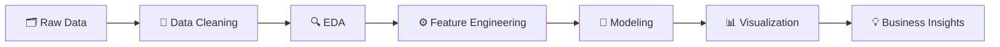

# 👋 Hi, I'm Mohan Kumar

### Data Analyst · SQL · Python · Power BI · Machine Learning

 

---

## 🧑‍💻 About Me

I'm a **Junior Data Analyst** passionate about transforming raw datasets into meaningful insights that drive data-driven decisions.

- 🔍 Experienced in **SQL**, **Python**, **Power BI**, and **Machine Learning**
- 📈 Specialized in **Time Series Forecasting** and **Exploratory Data Analysis (EDA)**
- 📊 Skilled at building interactive dashboards that communicate business value
- 🌱 Currently deepening expertise in **Data Warehousing**, **DAX**, and **Advanced SQL Optimization**

---

## 📊 Portfolio at a Glance

| 📁 Analytics Projects | 🤖 ML Projects | 📊 Power BI Dashboards | 📈 Forecasting Models | 🏅 Certifications |
|:---:|:---:|:---:|:---:|:---:|
| 10+ | 5+ | 5+ | 10+ | 10+ |

---

## ⚡ Tech Stack

### 🐍 Programming & Data

### 📊 Data Analysis & Visualization

### 🤖 Machine Learning & Forecasting

---

## 🚀 Featured Projects

### 💱 Currency Exchange Rate Forecasting
> **Python · LSTM · ARIMA · SVR · Random Forest**

Built hybrid time series forecasting models to predict **EUR/INR** and **USD/INR** exchange rates. Benchmarked multiple model combinations — LSTM-ARIMA, LSTM-SVR, and SVR-RF — with **LSTM-SVR** delivering the best forecasting performance.

---

### 🏨 Revenue Insights — Hospitality Domain
> **Power BI · SQL · Excel · Python**

Designed an interactive executive-level dashboard covering revenue trends, occupancy rates, customer ratings, and booking patterns. Enabled hotel leadership to make faster, insight-backed decisions through clear KPI storytelling.

---

### ❤️ Heart Disease Prediction
> **Python · Scikit-Learn · Pandas**

Built end-to-end classification pipelines using **Logistic Regression**, **Decision Tree**, and **Random Forest** to predict heart disease risk from patient health indicators. Focused on interpretability alongside accuracy.

---

## 🔄 Analytics Workflow

---

## 📈 GitHub Statistics

---

## 🌱 Currently Learning

- 🗃️ Advanced SQL Optimization & Query Tuning
- 🏗️ Data Modeling — Star & Snowflake Schema Design
- 📐 Power BI DAX & Data Warehousing Concepts
- 📉 Advanced Forecasting Techniques

---

## 🎓 Education

| Degree | Institution | Year | CGPA |
|--------|------------|------|------|
| 🎓 M.Sc. Data Science | Kalasalingam Academy of Research and Education | 2022 – 2024 | 7.84 |
| 🎓 B.Sc. Mathematics | G.V.N College | 2019 – 2022 | 8.86 |

---

## 🏅 Certifications

- 📊 Building Interactive Dashboards with Microsoft Power BI
- 🐍 Data Visualization using Python
- 📈 Data Analytics & Visualization using Excel and Python
- 🧪 Manual Testing Certification
- 🤖 AI Conference Participation Certifications

---

## 📫 Get in Touch

| 📧 Email | 💼 LinkedIn | 🌐 Portfolio | 🐙 GitHub | 📱 Phone |
|:---:|:---:|:---:|:---:|:---:|
| [mohankumar.ramadas@gmail.com](mailto:mohankumar.ramadas@gmail.com) | [mohankumar-qa](https://www.linkedin.com/in/mohankumar-qa) | [datascienceportfol.io](https://datascienceportfol.io/mohankumar_dxplr) | [mohankumar-dxplr](https://github.com/mohankumar-dxplr) | +91 8667298026 |

---

### 📊 *"Turning Data Into Decisions"*

⭐ If you find my projects useful, feel free to **star** the repositories — it means a lot!

