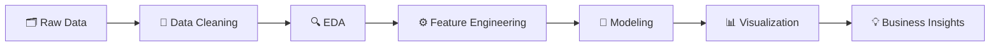

# 👋 Hi, I'm Mohan Kumar

### Data Analyst · SQL · Python · Power BI · Machine Learning

 

---

## 🧑‍💻 About Me

I'm a **Junior Data Analyst** passionate about transforming raw datasets into meaningful insights that drive data-driven decisions across industries.

- 🔍 Experienced in **SQL**, **Python**, **Power BI**, and **Machine Learning**
- 📈 Specialized in **Time Series Forecasting**, **Exploratory Data Analysis (EDA)**, and **Interactive Dashboarding**
- 🏭 Applying analytics across **Manufacturing**, **Automotive**, **Banking**, **Retail/E-commerce**, **Healthcare**, and **Logistics** domains
- 📊 Skilled at building end-to-end data pipelines — from raw data ingestion to executive-level dashboards
- 🌱 Currently deepening expertise in **Data Warehousing**, **DAX**, and **Advanced SQL Optimization**

---

## 💼 Work Experience

### 🟢 Junior QA Analyst — Firebee Techno Services

📍 Madurai, India &nbsp;|&nbsp; 🗓️ Mar 2025 – May 2026

- Performed functional, regression, integration, and UAT testing in **Agile environments**, contributing to test design and improved coverage
- Identified and documented bugs, working closely with developers to ensure timely resolution
- Experienced with **Postman** and **Excel** for manual testing, and **Playwright with Python** for automation; familiar with SDLC and STLC

---

### 🔵 QA Trainee — Predart Technologies

📍 Theni, India &nbsp;|&nbsp; 🗓️ Jun 2024 – Mar 2025

- Developed and executed manual test cases to ensure software quality
- Gained proficiency in **test planning**, **bug tracking**, and **defect reporting**
- Collaborated cross-functionally to understand requirements and deliver high-quality releases

---

### 🟣 Data Science Intern — Shiash Info Solutions

📍 Chennai, India &nbsp;|&nbsp; 🗓️ Dec 2023 – Apr 2024

- Performed **machine learning modeling**, data visualization, and time series analysis
- Developed **Django-based** data science web applications
- Built predictive models and dashboards that improved insight delivery speed by **20%**

---

## ⚡ Skills & Tech Stack

### 🐍 Programming Languages

  
  
  

### 🗄️ Database & Spreadsheet

  
  
  
  

### 🔬 Data Analytics

  
  
  

### 📊 Data Visualization

  
  
  
  
  

### 🤖 Machine Learning & Deep Learning

  
  
  
  
  

### 🛠️ Tools & Frameworks

  
  
  
  

### 🧠 Soft Skills

| 💡 Analytical Thinking | 🔍 Attention to Detail | 🗣️ Communication | 🧩 Problem-Solving | ⏰ Time Management |
| :--------------------: | :--------------------: | :----------------: | :----------------: | :----------------: |
|           ✅           |           ✅           |         ✅         |         ✅         |         ✅         |

---

## 🚀 Featured Projects

### 💱 [Currency Exchange Rate Forecasting](https://github.com/mohankumar-dxplr/Currency-Exchange-Rate-Forecasting)

> **Python · TensorFlow/Keras · LSTM · ARIMA · SVR · Random Forest · Statsmodels**

Built hybrid time-series models to forecast **EUR/INR**, **USD/INR**, and **NZD/USD** exchange rates across 12 notebooks. Benchmarked **LSTM-ARIMA**, **LSTM-SVR**, and **SVR-RF** pipelines — **LSTM-SVR** delivered the best performance across all currency pairs. Includes a conference paper and presentation.

---

### 🌍 [Global Development Analytics](https://github.com/mohankumar-dxplr/Data_Analytics/tree/main/GlobalDev%20Analytics)

> **Python · Pandas · Scikit-Learn · Matplotlib · Seaborn · Jupyter**

Comprehensive analysis of **191 countries** (1990–2021) using the Human Development Index and World Bank indicators. Built a star-schema ETL pipeline reshaping **1,008-column wide data** into a queryable fact/dim model (224K rows). Delivered **12 analysis workstreams** — HDI tier classification at **92.3% accuracy**, time-series forecasting at **99.55% R²**, sustainability clustering, gender inequality, and COVID-19 impact analysis. Produced **15+ markdown reports** and **46 publication-quality PNG visuals**.

---

### 🏨 [Revenue Insights — Hospitality Domain](https://github.com/mohankumar-dxplr/Data_Analytics/tree/main/Revenue%20Insights%20in%20Hospitality%20Domain%20Report)

> **Power BI · Python · DAX · Excel · SQL**

Designed an executive Power BI dashboard analyzing **134,591 booking records** across **26 hotels** in 4 cities. Covers **revenue by category (Luxury/Business), occupancy rates, booking platform performance, and weekly trends** using dimensional data models (date, room, booking dimensions). Delivered insight-ready PDF exports alongside the `.pbip` report.

---

### 🏪 [Contoso Retail Data Analytics](https://github.com/mohankumar-dxplr/Data_Analytics/tree/main/Contoso%20Retail%20Data%20Analytics)

> **Python · Pandas · Scikit-Learn · Matplotlib · Seaborn · Plotly**

Full retail analytics pipeline for a global electronics retailer with **67 stores across 8 countries**. Built a formal data pipeline (raw → cleaned → transformed) spanning 2016–2021. Delivered **RFM customer segmentation**, **$55.8M revenue analysis**, **58.6% profit margin** assessment, **67K+ product affinity pairs**, and a **658-line executive client report** with **13 detailed markdown reports** and **23 charts**.

---

### 🍬 [Candy Distributor Analysis](https://github.com/mohankumar-dxplr/Data_Analytics/tree/main/Candy_Distributor_Analysis)

> **Python · Power BI · Pandas · NumPy · Seaborn · Plotly**

End-to-end supply chain analytics with a **versioned data pipeline (v0 → v1 → v2)** across **5 cleaning notebooks** and **3 feature engineering notebooks**. Delivered a Power BI dashboard (`candy_distribution.pbix`) on **10,189 consolidated rows**, data quality validation detecting division-level mismatches, and a detailed markdown report. Includes `requirements.txt` with **54 pinned packages** for reproducibility.

---

### 🏏 [T20 Cricket Analytics](https://github.com/mohankumar-dxplr/Data_Analytics/tree/main/T20%20CRICKET%20ANALYTICS%20REPORT)

> **Power BI · DAX · Python**

Sports analytics dashboard built on a **dimensional star-schema** covering **46 matches**, **230 players**, **700 batting records**, and **501 bowling records**. Enables interactive player and team comparison through Power BI with match summaries, performance metrics, and strategic insights.

---

### ❤️ [Heart Disease Prediction](https://github.com/mohankumar-dxplr/Machine-Learning/tree/main/Heart_Disease%20Prediction)

> **Python · Scikit-Learn · Pandas · Matplotlib**

End-to-end classification pipeline comparing **Logistic Regression**, **Decision Tree**, and **Random Forest** for heart disease risk prediction from patient health indicators. Focused on **model interpretability** alongside accuracy with feature importance analysis and performance benchmarking.

---

### 🫁 [Pneumonia Detection with CNN](https://github.com/mohankumar-dxplr/Deep-Learning)

> **Python · TensorFlow/Keras · OpenCV · Scikit-Learn**

Built a **Convolutional Neural Network** to classify chest X-ray images for pneumonia detection. Also includes **Customer Churn Modeling** (ANN) and **Cat vs Dog** image classification — covering full deep learning pipelines from dataset preparation to model evaluation.

---

### 🏠 [House Price Prediction](https://github.com/mohankumar-dxplr/Machine-Learning/tree/main/House_Price_Prediction%20Detailed%20Analysis)

> **Python · Scikit-Learn · Pandas · Matplotlib · Seaborn**

Thorough regression analysis with dedicated notebooks for **EDA, feature engineering, feature selection, and model building**. Benchmarked multiple algorithms with hyperparameter tuning to identify the best-performing model for real estate price estimation.

---

## 🔄 Analytics Workflow

```mermaid
flowchart LR
    A[🗂️ Raw Data] --> B[🧹 Data Cleaning]
    B --> C[🔍 EDA]
    C --> D[⚙️ Feature Engineering]
    D --> E[🤖 Modeling]
    E --> F[📊 Visualization]
    F --> G[💡 Business Insights]
```

---

## 📈 GitHub Statistics

---

## 🌱 Currently Learning

- 🗃️ Advanced SQL Optimization & Query Tuning
- 🏗️ Data Modeling — Star & Snowflake Schema Design
- 📐 Power BI DAX & Data Warehousing Concepts
- 📉 Advanced Forecasting Techniques

---

## 🎓 Education

| Degree                | Institution                                    | Year         | CGPA |
| --------------------- | ---------------------------------------------- | ------------ | ---- |
| 🎓 M.Sc. Data Science | Kalasalingam Academy of Research and Education | 2022 – 2024 | 7.84 |
| 🎓 B.Sc. Mathematics  | G.V.N College                                  | 2019 – 2022 | 8.86 |

---

## 🏅 Certifications

### 📖 Infosys Springboard

| Course                                 | Date     |
| -------------------------------------- | -------- |
| Machine Learning & Data Analytics      | Jan 2025 |
| Explore Machine Learning using Python  | Jan 2025 |
| Software Testing — Testing Techniques | Jan 2025 |
| Association Analysis using Python      | Jan 2025 |
| Data Visualisation using Python        | Feb 2025 |

### 📖 Great Learning

| Course                           | Verify                                               |
| -------------------------------- | ---------------------------------------------------- |
| Basics of EDA                    | [Verify](https://verify.mygreatlearning.com/BRHOUOZU) |
| Data Visualization with Power BI | [Verify](https://verify.mygreatlearning.com/LEMWEQHN) |

### 📖 LinkedIn Learning

| Course                                                              | Date     |
| ------------------------------------------------------------------- | -------- |
| Learning Data Analytics: 1 Foundations                              | Jul 2024 |
| Learning Data Analytics Part 2: Extending & Applying Core Knowledge | Jul 2024 |

### 📖 Other

| Course                                          | Issuer                | Date     |
| ----------------------------------------------- | --------------------- | -------- |
| Introduction to Data Analytics                  | SimpleLearn           | Feb 2025 |
| Introduction to PySpark for Beginners           | Simplilearn           | Mar 2025 |
| Currency Exchange Rate Forecasting — ICAI 2024 | ICAI Conference       | 2024     |
| Data Science Internship                         | Shiash Info Solutions | Jun 2024 |

---

## 📫 Get in Touch

| 📧 Email | 💼 LinkedIn | 🌐 Portfolio | 🐙 GitHub | 📱 Phone |
|:---:|:---:|:---:|:---:|:---:|
| [mohankumar.ramadas@gmail.com](mailto:mohankumar.ramadas@gmail.com) | [mohankumar-dxplr](https://www.linkedin.com/in/mohankumar-dxplr) | [datascienceportfol.io](https://datascienceportfol.io/mohankumar_dxplr) | [mohankumar-dxplr](https://github.com/mohankumar-dxplr) | +91 8667298026 |

---

### 📊 *"Turning Data Into Decisions"*

⭐ If you find my projects useful, feel free to **star** the repositories — it means a lot!

