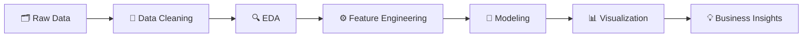

# 👋 Hi, I'm Mohan Kumar

### Data Analyst · SQL · Python · Power BI · Machine Learning

 

---

## 🧑‍💻 About Me

I'm a **Junior Data Analyst** passionate about transforming raw datasets into meaningful insights that drive data-driven decisions across industries.

- 🔍 Experienced in **SQL**, **Python**, **Power BI**, and **Machine Learning**
- 📈 Specialized in **Time Series Forecasting**, **Exploratory Data Analysis (EDA)**, **Recommendation Systems**, and **Interactive Dashboarding**
- 🏭 Applying analytics across **Finance**, **Healthcare**, **Retail/E-commerce**, **Manufacturing**, **Sports**, and **Logistics** domains
- 📊 Skilled at building end-to-end data pipelines — from raw data ingestion to executive-level dashboards
- 🌱 Currently deepening expertise in **Data Warehousing**, **DAX**, and **Advanced SQL Optimization**

---

## 💼 Work Experience

### 🟢 Junior QA Analyst — Firebee Techno Services
📍 Madurai, India &nbsp;|&nbsp; 🗓️ Mar 2025 – May 2026
- Performed functional, regression, integration, and UAT testing in **Agile environments**
- Identified and documented bugs, working closely with developers to ensure timely resolution
- Experienced with **Postman**, **Excel**, and **Playwright with Python** for test automation

---

### 🔵 QA Trainee — Predart Technologies
📍 Theni, India &nbsp;|&nbsp; 🗓️ Jun 2024 – Mar 2025
- Developed and executed manual test cases for software quality assurance
- Gained proficiency in **test planning**, **bug tracking**, and **defect reporting**

---

### 🟣 Data Science Intern — Shiash Info Solutions
📍 Chennai, India &nbsp;|&nbsp; 🗓️ Dec 2023 – Apr 2024
- Performed **machine learning modeling**, data visualization, and time series analysis
- Developed predictive models and dashboards that improved insight delivery speed by **20%**
- Built projects across stock market prediction, customer segmentation, sentiment analysis, and healthcare analytics

---

## ⚡ Skills & Tech Stack

### 🐍 Programming Languages

  
  
  

### 🗄️ Database & Spreadsheet

  
  
  

### 🔬 Data Analytics

  
  
  

### 📊 Data Visualization

  
  
  
  
  

### 🤖 Machine Learning & Deep Learning

  
  
  
  
  
  

### 🛠️ Tools & Frameworks

  
  
  
  

### 🧠 Soft Skills
| 💡 Analytical Thinking | 🔍 Attention to Detail | 🗣️ Communication | 🧩 Problem-Solving | ⏰ Time Management |
| :--------------------: | :--------------------: | :----------------: | :----------------: | :----------------: |
|           ✅           |           ✅           |         ✅         |         ✅         |         ✅         |

---

## 🚀 Featured Projects

### 🔮 Time Series & Forecasting

<strong>💱 Currency Exchange Rate Forecasting</strong> — Python · TensorFlow/Keras · LSTM · ARIMA · SVR · Random Forest · Statsmodels

**Repo:** [Currency-Exchange-Rate-Forecasting](https://github.com/mohankumar-dxplr/Currency-Exchange-Rate-Forecasting)

Hybrid time-series models to forecast **EUR/INR**, **USD/INR**, and **NZD/USD** exchange rates across **12 notebooks**. Benchmarked **4 hybrid approaches** (LSTM-RF, LSTM-SVR, LSTM-ARIMA, SVR-RF) on 20+ years of daily data (2002–2023). The **LSTM-RF hybrid** achieved the best performance with **R² = 0.9967** on USD/INR. Includes a published conference paper and presentation.

**Key techniques:** Two-stage hybrid framework, transfer learning, residual correction

<strong>⚡ Stock Market Prediction</strong> — Python · Statsmodels · pmdarima · scikit-learn

**Repo:** [Shiash-Info-Solutions/stock_market_prediction](https://github.com/mohankumar-dxplr/Shiash-Info-Solutions/tree/main/stock_market_prediction)

ARIMA and Auto-ARIMA time-series forecasting for HCL Technologies (HCLTECH) stock prices using NSE historical data from 2000. Includes stationarity testing (ADF), log transformation, differencing, and evaluation with MAE, MSE, RMSE, MAPE, and R² metrics.

---

### 🏥 Healthcare & Medical Analytics

<strong>🫁 Pneumonia Detection with CNN</strong> — Python · TensorFlow/Keras · OpenCV

**Repo:** [Deep-Learning/1-Pnemonia Detection](https://github.com/mohankumar-dxplr/Deep-Learning/tree/main/1-Pnemonia%20Detection)

VGG16 **transfer learning** + fine-tuning on chest X-rays to classify pneumonia vs. normal. Achieved **~90.5% accuracy** with data augmentation and learning rate scheduling. Part of a 3-project deep learning collection also including **Customer Churn Modeling** (ANN, 85% accuracy) and **Cat vs Dog** image classification (custom CNN).

<strong>❤️ Heart Disease Prediction</strong> — Python · Scikit-Learn · Pandas · Matplotlib

**Repo:** [Machine-Learning/Heart_Disease Prediction](https://github.com/mohankumar-dxplr/Machine-Learning/tree/main/Heart_Disease%20Prediction)

End-to-end binary classification comparing **Logistic Regression**, **Decision Tree**, and **Random Forest** for heart disease risk prediction from patient health indicators (303 records, 14 features). Focused on model interpretability alongside accuracy benchmarking.

<strong>🫀 Heart Attack Risk Prediction</strong> — Python · Scikit-Learn · SMOTE · imbalanced-learn

**Repo:** [Shiash-Info-Solutions/Heart_attack_risk_prediction](https://github.com/mohankumar-dxplr/Shiash-Info-Solutions/tree/main/Heart_attack_risk_prediction)

Binary classification on **13K+ patient records** comparing Logistic Regression, Random Forest, and Decision Tree with **SMOTE oversampling** to handle class imbalance. **Random Forest** achieved the best performance (95% accuracy, ROC AUC 0.80).

<strong>📈 Life Expectancy Prediction</strong> — Python · Scikit-Learn · ptitprince

**Repo:** [Shiash-Info-Solutions/life_expenctency](https://github.com/mohankumar-dxplr/Shiash-Info-Solutions/tree/main/life_expenctency)

Linear regression on WHO health/economic indicators (182 countries) to predict life expectancy. Achieved **R² = 0.902** with MinMax scaling. Featured raincloud plots (`ptitprince`) for distribution visualization.

<strong>💉 Diabetes Analytics</strong> — Python · Scikit-Learn · 7-model comparison

**Repo:** [Machine-Learning/Diabetes Analytics](https://github.com/mohankumar-dxplr/Machine-Learning/tree/main/Diabetes%20Analytics)

Comprehensive classification comparison on the Pima Indians Diabetes dataset using **7 models**: KNN, Logistic Regression, Decision Tree, Random Forest, Gradient Boosting, SVM, and MLP Neural Network. Includes visual model comparison outputs and hyperparameter tuning.

---

### 🏠 Regression & Price Prediction

<strong>🏠 House Price Prediction</strong> — Python · Scikit-Learn · Pandas · Seaborn

**Repo:** [Machine-Learning/House_Price_Prediction Detailed Analysis](https://github.com/mohankumar-dxplr/Machine-Learning/tree/main/House_Price_Prediction%20Detailed%20Analysis)

A comprehensive **3-stage ML pipeline** on the Kaggle Ames Housing dataset: **EDA** (80+ features, missing values, outliers) → **Feature Engineering** (imputation, temporal variables, rare label encoding) → **Feature Selection** (Lasso L1 regularization with `SelectFromModel`). Covers the full workflow from raw data to selected features.

<strong>🚗 Automobile Price Prediction</strong> — Python · Statsmodels · OLS Regression

**Repo:** [Shiash-Info-Solutions/Automobile_Price_Prediction](https://github.com/mohankumar-dxplr/Shiash-Info-Solutions/tree/main/Automobile_Price_Prediction)

Multiple Linear Regression (OLS) on the UCI Automobile dataset. Includes missing value handling, one-hot encoding, StandardScaler normalization, and evaluation with MSE and R². Includes a detailed ODT project report.

<strong>💻 Laptop Price Prediction</strong> — Python · Scikit-Learn · GridSearchCV

**Repo:** [Machine-Learning/Laptop_Price_Prediction](https://github.com/mohankumar-dxplr/Machine-Learning/tree/main/Laptop_Price_Prediction)

Regression with Decision Tree and Random Forest on laptop specifications. Includes Z-score outlier removal, hyperparameter tuning with GridSearchCV, residual analysis, and feature importance interpretation.

<strong>🏡 House Rent Prediction</strong> — Python · Scikit-Learn · SHAP

**Repo:** [Shiash-Info-Solutions/House_Rent_Prediction](https://github.com/mohankumar-dxplr/Shiash-Info-Solutions/tree/main/House_Rent_Prediction)

3-regressor comparison (Decision Tree, Random Forest, Linear Regression) on **4,746 Indian rental listings** with **SHAP explainability** for model interpretability. Includes label encoding, MinMax scaling, and MAPE evaluation.

<strong>💰 Medical Cost Analysis</strong> — Python · Scikit-Learn · Polynomial Features

**Repo:** [Machine-Learning/Medical Cost Analysis](https://github.com/mohankumar-dxplr/Machine-Learning/tree/main/Medical%20Cost%20Analysis)

Insurance cost regression comparing Linear Regression, Polynomial Features, and Random Forest on demographic/health attributes (age, bmi, smoking status, region) from 1,338 records.

---

### 🛒 Retail & E-Commerce Analytics

<strong>🏪 Contoso Retail Data Analytics</strong> — Python · Pandas · RFM · Plotly

**Repo:** [Data_Analytics/Contoso Retail Data Analytics](https://github.com/mohankumar-dxplr/Data_Analytics/tree/main/Contoso%20Retail%20Data%20Analytics)

Full retail analytics pipeline for a global electronics retailer with **67 stores across 8 countries** (2016–2021). Delivered **RFM customer segmentation**, **$55.8M revenue analysis**, **58.6% profit margin** assessment, **67K+ product affinity pairs**, and a **658-line executive client report** with 23 charts.

<strong>🏨 Revenue Insights — Hospitality Domain</strong> — Power BI · DAX · SQL

**Repo:** [Data_Analytics/Revenue Insights in Hospitality Domain Report](https://github.com/mohankumar-dxplr/Data_Analytics/tree/main/Revenue%20Insights%20in%20Hospitality%20Domain%20Report)

Executive Power BI dashboard analyzing **134,591 booking records** across **26 hotels** in 4 cities. Covers revenue by category (Luxury/Business), occupancy rates, booking platform performance, and weekly trends with dimensional data models.

<strong>🍬 Candy Distributor Analysis</strong> — Python · Power BI · Pandas

**Repo:** [Data_Analytics/Candy_Distributor_Analysis](https://github.com/mohankumar-dxplr/Data_Analytics/tree/main/Candy_Distributor_Analysis)

End-to-end supply chain analytics with a **versioned data pipeline (v0 → v1 → v2)** across 5 cleaning and 3 feature engineering notebooks. Delivered a Power BI dashboard on **10,189 consolidated rows** with data quality validation. Includes `requirements.txt` with **54 pinned packages**.

<strong>👥 Mall Customer Segmentation</strong> — Python · Scikit-Learn · K-Means

**Repo:** [Shiash-Info-Solutions/Mall Clustering EDA](https://github.com/mohankumar-dxplr/Shiash-Info-Solutions/tree/main/Mall%20Clustering%20EDA)

Customer segmentation using **K-Means clustering** with univariate (income), bivariate (income × spending score), and multivariate (age + income + spending score) approaches. Includes StandardScaler preprocessing and scatter plot visualizations.

<strong>📦 Customer Segmentation (Online Retail)</strong> — Python · Pandas · RFM Analysis

**Repo:** [Machine-Learning/Customer_Segmentation_Online_Retail](https://github.com/mohankumar-dxplr/Machine-Learning/tree/main/Customer_Segmentation_Online_Retail)

RFM (Recency, Frequency, Monetary) analysis on UK online retail transactional data (~541K rows). Data cleaning and feature engineering for customer segmentation insights.

---

### 📊 Data Visualization

<strong>📉 Data Visualization with Matplotlib & Seaborn</strong> — Python · Matplotlib · Seaborn · Plotly

**Repo:** [Data-Vizualization](https://github.com/mohankumar-dxplr/Data-Vizualization)

Educational visualization tutorials using **IPL cricket statistics** as the primary dataset. Covers Matplotlib (line plots, scatter plots, bar charts, grouped bars, custom styling) and Seaborn (categorical plots, regression plots, faceting, hue parameters) with the `tips` and `iris` built-in datasets.

<strong>🏏 Cricket Asia Cup EDA</strong> — Python · Plotly · Pandas

**Repo:** [Machine-Learning/cricket-asia cup](https://github.com/mohankumar-dxplr/Machine-Learning/tree/main/cricket-asia%20cup)

Interactive Plotly-based exploratory data analysis of Asia Cup cricket matches from 1984 to 2022. Visualizes team performance, toss decisions, runs, wickets, and strike rates from 255 match records.

---

### 🌍 Global & Socio-Economic Analytics

<strong>🌍 Global Development Analytics</strong> — Python · Pandas · Scikit-Learn

**Repo:** [Data_Analytics/GlobalDev Analytics](https://github.com/mohankumar-dxplr/Data_Analytics/tree/main/GlobalDev%20Analytics)

Comprehensive analysis of **191 countries** (1990–2021) using HDI and World Bank indicators. Built a star-schema ETL pipeline reshaping **1,008-column wide data** into a queryable fact/dim model (224K rows). Delivered **12 analysis workstreams** — HDI tier classification at **92.3% accuracy**, time-series forecasting at **99.55% R²**, sustainability clustering, gender inequality, and COVID-19 impact analysis.

<strong>💰 Adult Salary / Income Analysis</strong> — Python · Scikit-Learn · Logistic Regression

**Repo:** [Machine-Learning/Adult_salary_prediction](https://github.com/mohankumar-dxplr/Machine-Learning/tree/main/Adult_salary_prediction) · [Income_Analysis](https://github.com/mohankumar-dxplr/Machine-Learning/tree/main/Income_Analysis)

Binary classification on UCI Adult census data (~32K records) to predict whether income exceeds $50K. Logistic Regression with StandardScaler, evaluated via confusion matrix, accuracy, and classification report.

---

### 🎓 Academic Exercise Series

<strong>🧠 Deep Learning Exercise Series</strong> — Python · TensorFlow/Keras · 13 notebooks

**Repo:** [DL-Exercise](https://github.com/mohankumar-dxplr/DL-Exercise)

A progressive series of **13 notebooks** covering TensorFlow/Keras fundamentals:
- **Linear Perceptron** → **ANN** (regression & classification)
- **CNN** for MNIST and Cats vs Dogs
- **RNN** for stock price and word prediction
- **Embedding layers** for NLP sentiment analysis
- **Keras constraints & regularizers** (NonNeg, UnitNorm, MaxNorm)
- **Tensor manipulation** and **loss function mathematics** (Binary/Categorical/Sparse Categorical Crossentropy)

<strong>📐 Machine Learning Exercise Series</strong> — Python · Scikit-Learn · Statsmodels · 26 notebooks

**Repo:** [ML-Exercise](https://github.com/mohankumar-dxplr/ML-Exercise)

A collection of **26 exercise notebooks** across **11 topics**: Decision Trees, Hierarchical Clustering, K-Means (5 notebooks), KNN, Lasso, Linear Regression (confidence intervals, hypothesis testing), Logistic Regression (3 notebooks), Multiple Linear Regression, Naive Bayes, PCA, Ridge, and SVM. Uses classic datasets (Iris, Boston Housing, Wine Quality, Breast Cancer, Diabetes, Hald Cement, Egyptian Skulls).

<strong>🎯 Recommendation System Exercise Series</strong> — Python · Scikit-Learn · Statsmodels · 11 notebooks

**Repo:** [Recommendation-System-Exercise](https://github.com/mohankumar-dxplr/Recommendation-System-Exercise)

**11 notebooks** covering the full recommendation system landscape:
- **Collaborative Filtering:** User-based (standard scaling + NN), Item-based (cosine similarity), Model-based (Linear Regression, Decision Trees, Categorical Naive Bayes)
- **Dimensionality Reduction:** PCA + Decision Trees
- **Feature Selection:** Entropy, Gini Index, Chi-Square
- **Content-Based RS:** TF-IDF + Gaussian Naive Bayes, TF-IDF + PCA + Logistic Regression

<strong>🔬 Hyperparameter Tuning Showcase</strong> — Python · 6 optimization techniques

**Repo:** [Machine-Learning/Hyper_parameter_tuning](https://github.com/mohankumar-dxplr/Machine-Learning/tree/main/Hyper_parameter_tuning)

Demonstrates **6 hyperparameter optimization techniques** on Random Forest: GridSearchCV, RandomizedSearchCV, Bayesian Optimization (Hyperopt), Scikit-Optimize, Optuna, and TPOT (genetic programming).

---

### 📊 Power BI Dashboards

<strong>🏏 T20 Cricket Analytics</strong> — Power BI · DAX

**Repo:** [Data_Analytics/T20 CRICKET ANALYTICS REPORT](https://github.com/mohankumar-dxplr/Data_Analytics/tree/main/T20%20CRICKET%20ANALYTICS%20REPORT)

Sports analytics dashboard on a **dimensional star-schema** covering **46 matches**, **230 players**, **700 batting records**, and **501 bowling records**. Enables interactive player and team comparison with match summaries and performance metrics.

<strong>🏨 Revenue Insights — Hospitality</strong> — Power BI · DAX · SQL

**Repo:** [Data_Analytics/Revenue Insights in Hospitality Domain Report](https://github.com/mohankumar-dxplr/Data_Analytics/tree/main/Revenue%20Insights%20in%20Hospitality%20Domain%20Report)

Executive dashboard for **134,591 bookings** across **26 hotels** in 4 cities. Revenue analysis by category, occupancy trends, booking platform performance, and weekly patterns.

---

### NLP & Sentiment Analysis

<strong>📝 Amazon Product Reviews Sentiment Analysis</strong> — Python · NLTK · XGBoost · 6 classifiers

**Repo:** [Shiash-Info-Solutions/Amazon product customer reviews segmentation](https://github.com/mohankumar-dxplr/Shiash-Info-Solutions/tree/main/Amazon%20product%20customer%20reviews%20segmentation)

Sentiment analysis on Amazon Books and Grocery reviews using **6 classifiers per dataset**: Bernoulli Naive Bayes, SVM, KNN, Decision Tree, Random Forest, and XGBoost. NLP pipeline with Porter stemming, stopword removal, and TF-IDF/CountVectorizer feature extraction. Hyperparameter tuning with GridSearchCV.

<strong>🎬 IMDB Sentiment Analysis</strong> — Python · NLTK · TF-IDF · 3 classifiers

**Repo:** [Machine-Learning/IMDB Sentiment Analysis](https://github.com/mohankumar-dxplr/Machine-Learning/tree/main/IMDB%20Sentiment%20Analysis)

NLP classification pipeline on 50K IMDB movie reviews with tokenization, POS tagging, stopword removal, lemmatization, and TF-IDF vectorization. Models: Naive Bayes, SVM, and Logistic Regression.

---

### 🔬 Data Science Internship — Shiash Info Solutions

<strong>🏢 Full Project Portfolio</strong> — 8 projects across ML domains

**Repo:** [Shiash-Info-Solutions](https://github.com/mohankumar-dxplr/Shiash-Info-Solutions)

Completed during a **Data Science Internship** (Dec 2023 – Apr 2024). Includes **8 projects**:
- **Stock Market Prediction** (ARIMA/Auto-ARIMA)
- **Mall Customer Clustering** (K-Means)
- **Life Expectancy Prediction** (Linear Regression, R² = 0.902)
- **Automobile Price Prediction** (OLS Regression)
- **Heart Attack Risk Prediction** (RF 95% accuracy with SMOTE)
- **House Rent Prediction** (3 models + SHAP)
- **Employee Health EDA** (visual analytics)
- **Amazon Reviews Sentiment Analysis** (6 classifiers + NLP pipeline)

---

### 🔄 Analytics Workflow

```mermaid
flowchart LR
    A[🗂️ Raw Data] --> B[🧹 Data Cleaning]
    B --> C[🔍 EDA]
    C --> D[⚙️ Feature Engineering]
    D --> E[🤖 Modeling]
    E --> F[📊 Visualization]
    F --> G[💡 Business Insights]
```

---

## 📈 GitHub Statistics

---

## 🌱 Currently Learning

- 🗃️ Advanced SQL Optimization & Query Tuning
- 🏗️ Data Modeling — Star & Snowflake Schema Design
- 📐 Power BI DAX & Data Warehousing Concepts
- 📉 Advanced Forecasting Techniques

---

## 🎓 Education

| Degree | Institution | Year | CGPA |
| ------ | ---------------------------------------------- | ------------ | ---- |
| 🎓 M.Sc. Data Science | Kalasalingam Academy of Research and Education | 2022 – 2024 | 7.84 |
| 🎓 B.Sc. Mathematics | G.V.N College | 2019 – 2022 | 8.86 |

---

## 🏅 Certifications

### 📖 Infosys Springboard
| Course | Date |
| -------------------------------------- | -------- |
| Machine Learning & Data Analytics | Jan 2025 |
| Explore Machine Learning using Python | Jan 2025 |
| Software Testing — Testing Techniques | Jan 2025 |
| Association Analysis using Python | Jan 2025 |
| Data Visualisation using Python | Feb 2025 |

### 📖 Great Learning
| Course | Verify |
| --------------------------------- | ---------------------------------------------------- |
| Basics of EDA | [Verify](https://verify.mygreatlearning.com/BRHOUOZU) |
| Data Visualization with Power BI | [Verify](https://verify.mygreatlearning.com/LEMWEQHN) |

### 📖 LinkedIn Learning
| Course | Date |
| ------------------------------------------------------------------- | -------- |
| Learning Data Analytics: 1 Foundations | Jul 2024 |
| Learning Data Analytics Part 2: Extending & Applying Core Knowledge | Jul 2024 |

### 📖 Other
| Course | Issuer | Date |
| ----------------------------------------------- | --------------------- | -------- |
| Introduction to Data Analytics | Simplilearn | Feb 2025 |
| Introduction to PySpark for Beginners | Simplilearn | Mar 2025 |
| Currency Exchange Rate Forecasting — ICAI 2024 | ICAI Conference | 2024 |
| Data Science Internship | Shiash Info Solutions | Jun 2024 |

---

## 📫 Get in Touch

| 📧 Email | 💼 LinkedIn | 🌐 Portfolio | 🐙 GitHub | 📱 Phone |
|:---:|:---:|:---:|:---:|:---:|
| [mohankumar.ramadas@gmail.com](mailto:mohankumar.ramadas@gmail.com) | [mohankumar-dxplr](https://www.linkedin.com/in/mohankumar-dxplr) | [datascienceportfol.io](https://datascienceportfol.io/mohankumar_dxplr) | [mohankumar-dxplr](https://github.com/mohankumar-dxplr) | +91 8667298026 |

---

### 📊 *"Turning Data Into Decisions"*

⭐ If you find my projects useful, feel free to **star** the repositories — it means a lot!

